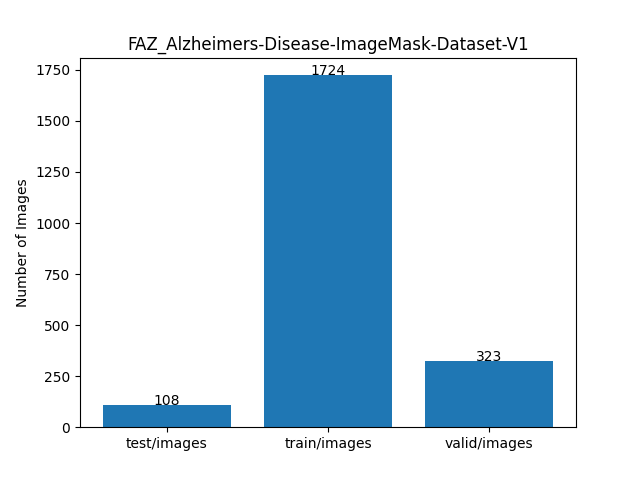

<h2> ImageMask-Dataset-FAZ_Alzheimer-s-Disease (2024/04/08)</h2>

This is ImageMask Dataset for Alzheimers Disease. 
The dataset used here has been taken from the following zendo.org web-site 
<b>OCTA image dataset with pixel-level mask annotation for FAZ segmentation</b> 
<pre>
https://zenodo.org/records/5075563
</pre>

You can download the <b>FAZ_Alzheimers-Disease-ImageMask-Dataset</b> from the google drive
<a href="https://drive.google.com/file/d/1yOgBhScahk4yb-xCleNFUfEG3JkXSgwi/view?usp=sharing">
FAZ_Alzheimers-Disease-ImageMask-Dataset-V1.zip
</a>
 

<h3>1. Dataset Citation</h3>
<b>OCTA image dataset with pixel-level mask annotation for FAZ segmentation</b> 

Yufei Wang, Yiqing Shen, Meng Yuan, Jing Xu, Wei Wang and Weijing Cheng 
<pre>
This dataset is publish by the research "A Deep Learning-based Quality Assessment and Segmentation System 
with a Large-scale Benchmark Dataset for Optical Coherence Tomographic Angiography Image"

Detail:
This dataset is the pixel-level mask annotation for FAZ segmentation. 1,101 3 × 3 mm2 sOCTA images chosen 
from gradable and best OCTA images randomly in subset sOCTA-3x3-10k, and 1,143 6 × 6 mm2dOCTA images were 
an notated by an experienced ophthalmologist.
GitHub: https://github.com/shanzha09/COIPS

These datasets are public available, if you use the dataset or our system in your research, 
please cite our paper: 
A Deep Learning-based Quality Assessment and Segmentation System with a Large-scale Benchmark 
Dataset for Optical Coherence Tomographic Angiography Image.
</pre>

Please see also: 
<b>Hybrid-FAZ</b>
<pre>
https://github.com/kskim-phd/Hybrid-FAZ
</pre>
 

<h3>2. ImageMaskDataset Generation</h3>

Please download the master dataset from the following link on zendo.org.  
<b>OCTA image dataset with pixel-level mask annotation for FAZ segmentation</b> 
<pre>
https://zenodo.org/records/5075563
</pre>

</pre>

Please run the following command for Python script <a href="./ImageMaskDatasetGenerator.py">ImageMaskDatasetGenerator.py</a>.
 
<pre>
> python ImageMaskDatasetGenerator.py
</pre>
, by which the following dataset, <b>/FAZ_Alzheimers-Disease_master</b>, will be created
 from the master datatset . 
<pre>
./FAZ_Alzheimers-Disease_master
├─images
└─masks
</pre>
To create the master dataset,we resized all images and masks of the original dataset to be 512x512 pixel-size.

Pleser run the following command for Python <a href="./split_master.py">split_master.py</a> 
 
<pre>
>python split_master.py
</pre>
, by which FAZ_Alzheimers-Disease-ImageMask-Dataset-V1 with test, train and valid subdataet will be created. 
<pre>
./FAZ_Alzheimers-Disease-ImageMask-Dataset-V1
├─test
│  ├─images
│  └─masks
├─train
│  ├─images
│  └─masks
└─valid
    ├─images
    └─masks
</pre>

Train images sample 
  
Train mask sample 
  

Dataset Statictics  
 
